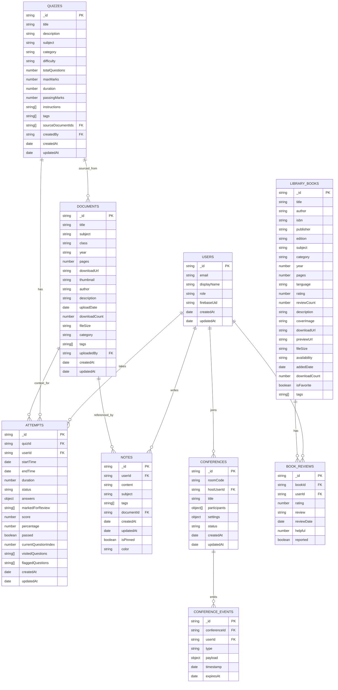

# Study-AI Platform — Database ERD and Schema Design

This document provides a comprehensive database entity-relationship (ER) design for the Study-AI Platform based on:

- Declared tech stack (MongoDB Atlas) in TECH_STACK.md
- Client-side TypeScript types in `client/src/types`
- Server-side model placeholders in `server/src/models`
- Overall product features (quizzes, study materials, notes, conferences, admin seeding)

Note: The current `server/src/models/*.ts` files are placeholders with no schema content. This ERD is a proposed, implementation-ready design aligned with the codebase’s domain.

## Overview

- Database: MongoDB Atlas (document-oriented)
- ODM (suggested): Mongoose
- Pattern: Reference for large aggregates; embed for localized/immutable sub-documents (e.g., quiz questions)
- Collections:
  - users
  - quizzes
  - attempts
  - documents (study materials)
  - notes
  - conferences
  - library_books (optional, from client types)
  - moderation, activity, and analytics (optional/future)

---

## ER Diagram (Mermaid)



---

## Collections and Schemas

Below are recommended MongoDB/Mongoose schema definitions with key fields, types, and indexes.

### 1) users

- Fields
  - \_id: ObjectId
  - email: string, unique, required
  - displayName: string
  - role: 'admin' | 'student' | 'moderator' (default: 'student')
  - firebaseUid: string, unique (maps to Firebase Auth)
  - createdAt, updatedAt: Date
- Indexes
  - Unique on email
  - Unique on firebaseUid
- Relations
  - 1..\* attempts
  - 1..\* notes
  - 1..\* conferences (host/participant)

### 2) quizzes

- Fields (aligned with `client/src/types/quiz.ts`)
  - \_id: ObjectId
  - title: string (req)
  - description: string
  - subject: string
  - category: string
  - difficulty: 'Beginner' | 'Intermediate' | 'Advanced'
  - totalQuestions: number
  - maxMarks: number
  - duration: number (minutes)
  - passingMarks: number
  - instructions: string[]
  - questions: [
    { id, question, type, options, correctAnswer, explanation, marks, timeLimit, difficulty, topics, image, diagram }
    ]
  - isTimeLimited, allowReview, shuffleQuestions, shuffleOptions, showResults, retakeAllowed: boolean
  - maxAttempts: number
  - createdBy: ObjectId (User)
  - createdAt, updatedAt
  - tags: string[]
  - prerequisites: string[]
  - sourceDocumentIds: ObjectId[] (Document)
- Indexes
  - subject, category, difficulty
  - text index: title + description + tags
  - createdBy
- Notes
  - Questions embedded for fast reads; answers resolved server-side for attempts

### 3) attempts

- Fields (aligned with `QuizAttempt` in client types)
  - \_id: ObjectId
  - quizId: ObjectId (Quiz)
  - userId: ObjectId (User)
  - startTime, endTime: Date
  - duration: number (seconds)
  - status: 'in-progress' | 'completed' | 'abandoned' | 'timeout'
  - answers: Record<string, any> (questionId → answer)
  - markedForReview: string[]
  - score: number
  - percentage: number
  - passed: boolean
  - submittedAt?: Date
  - timeRemaining?: number
  - currentQuestionIndex: number
  - visitedQuestions: string[]
  - flaggedQuestions: string[]
  - createdAt, updatedAt
- Indexes
  - Compound: { userId: 1, quizId: 1, createdAt: -1 }
  - status
- Notes
  - Consider TTL on unfinished attempts after N days

### 4) documents (study materials)

- Fields (aligned with `StudyMaterial` in client types)
  - \_id: ObjectId
  - title, subject, class, year: string
  - pages: number
  - downloadUrl, thumbnail: string (GCS)
  - author?: string, description?: string
  - uploadDate: Date
  - downloadCount: number
  - fileSize: string
  - category: 'lecture-notes' | 'assignments' | 'past-papers' | 'reference'
  - tags: string[]
  - uploadedBy: ObjectId (User) — optional if via admin CLI
  - createdAt, updatedAt
- Indexes
  - subject, class, year, category
  - text index: title + description + author + tags

### 5) notes

- Fields (aligned with `QuickNote` in client types)
  - \_id: ObjectId
  - userId: ObjectId (User)
  - content: string
  - subject?: string
  - tags: string[]
  - documentId?: ObjectId (Document)
  - createdAt, updatedAt
  - isPinned: boolean
  - color: string
- Indexes
  - Compound: { userId: 1, createdAt: -1 }
  - tags

### 6) conferences

- Fields
  - \_id: ObjectId
  - roomCode: string (unique, short)
  - hostUserId: ObjectId (User)
  - title: string
  - participants: [{ userId, joinedAt, role: 'host'|'guest', muted: boolean }]
  - settings: { record?: boolean, lobby?: boolean, maxParticipants?: number }
  - status: 'scheduled' | 'active' | 'ended'
  - createdAt, updatedAt
- Indexes
  - roomCode unique
  - hostUserId

### 7) conference_events (event stream)

- Fields
  - \_id: ObjectId
  - conferenceId: ObjectId (Conference)
  - userId?: ObjectId (User)
  - type: 'join' | 'leave' | 'message' | 'mute' | 'screen_share' | 'signal' | ...
  - payload: any
  - timestamp: Date
  - expiresAt?: Date (TTL for ephemeral events)
- Indexes
  - conferenceId + timestamp
  - TTL on { expiresAt } if set

### 8) library_books (optional, based on client types)

- Fields (aligned with `LibraryBook`)
  - \_id: ObjectId
  - title, author, isbn, publisher, edition
  - subject, category, year, pages, language
  - rating, reviewCount
  - description, coverImage
  - downloadUrl?, previewUrl?, fileSize?
  - availability: 'available' | 'borrowed' | 'reserved'
  - addedDate
  - downloadCount: number
  - isFavorite: boolean — per-user favorite should be separate if needed
  - tags: string[]
- Indexes
  - text index: title + author + description
  - subject, category, language

### 9) book_reviews (optional)

- Fields (aligned with `BookReview`)
  - \_id: ObjectId
  - bookId: ObjectId (LibraryBook)
  - userId: ObjectId (User)
  - rating: number (1-5)
  - review?: string
  - reviewDate: Date
  - helpful: number
  - reported: boolean
- Indexes
  - Compound: { bookId: 1, reviewDate: -1 }
  - userId

---

## Relationships Summary

- User 1..\* Attempt → Quiz n..1 (Attempt is the join, with additional fields)
- User 1..\* Note, Note may reference 0..1 Document
- Document 1..\* Note (inverse)
- Quiz 0..\* → Document (sourceMaterial) via reference IDs
- User many-to-many Conference via participants array and events
- LibraryBook 1.._ BookReview, User 1.._ BookReview

---

## Validation and Constraints

- users.email: required, email format, unique
- quizzes.title: required; difficulty enum enforced
- attempts.answers: ensure keys correlate to quiz.questions.id
- documents.category: enum; downloadUrl/thumbnail must be valid URLs
- conferences.roomCode: unique short-code; participants[].userId required
- book_reviews.rating: 1-5, integer

---

## Indexing Strategy

- Text search: quizzes(title, description, tags), documents(title, description, author, tags), library_books(title, author, description)
- High-cardinality filters: attempts(userId, quizId), notes(userId)
- Time-series queries: attempts(createdAt), conference_events(timestamp)
- Unique: users(email), users(firebaseUid), conferences(roomCode)

---

## Normalization Guidance (3NF mindset on MongoDB)

Although MongoDB is document-oriented, we apply a 3NF-inspired discipline for relational aspects to avoid anomalies:

- Users (1NF/2NF/3NF): Unique by email/firebaseUid. No repeating groups. Role is atomic. Profile extensions should live in a separate collection if they become sparse/optional.
- Quizzes ↔ Attempts: Attempts reference both quizId and userId (no duplicated quiz/user attributes). Derived stats (percentage, passed) are computed and stored for read speed but originate from atomic fields (score, maxMarks).
- Documents (Study Materials) ↔ Notes: Notes reference userId and documentId. Note content and tags are atomic arrays. No duplication of document metadata in notes.
- Conferences ↔ Events: Events reference conferenceId and optionally userId. Conference participants are embedded as small sub-documents (role, joinedAt) for locality; large or historical data (events) are separate.
- Library Books ↔ Book Reviews: Reviews reference bookId and userId; no author/title duplication inside reviews. Aggregate ratings should be computed from reviews and optionally cached on books.

When to embed vs reference (to stay “normalized”):

- Embed when the sub-structure is small, immutable, and always read with the parent (e.g., quiz questions).
- Reference when the sub-structure is large, shared across parents, changes independently, or queried separately at scale (e.g., attempts, events, reviews).

This keeps write patterns safe (no multi-document updates for the same fact) while leveraging MongoDB’s strengths.

## Example Documents

### Quiz (simplified)

```json
{
  "_id": "665f1a...",
  "title": "Algebra Basics",
  "subject": "Mathematics",
  "category": "Practice",
  "difficulty": "Beginner",
  "totalQuestions": 10,
  "maxMarks": 100,
  "duration": 30,
  "passingMarks": 40,
  "instructions": ["Read carefully", "No negative marking"],
  "questions": [
    {
      "id": "q1",
      "question": "2x + 3 = 7. Find x.",
      "type": "single-choice",
      "options": ["1", "2", "3", "4"],
      "correctAnswer": "2",
      "marks": 10,
      "difficulty": "easy",
      "topics": ["linear equations"]
    }
  ],
  "tags": ["algebra", "linear"],
  "createdBy": "665eab...",
  "createdAt": "2025-10-12T10:00:00.000Z"
}
```

### Attempt

```json
{
  "_id": "7760aa...",
  "quizId": "665f1a...",
  "userId": "665eab...",
  "startTime": "2025-10-12T10:05:00.000Z",
  "status": "completed",
  "answers": { "q1": "2" },
  "score": 10,
  "percentage": 100,
  "passed": true,
  "currentQuestionIndex": 9,
  "visitedQuestions": ["q1"],
  "createdAt": "2025-10-12T10:05:01.000Z"
}
```

### Document (Study Material)

```json
{
  "_id": "5f...",
  "title": "Thermodynamics Notes",
  "subject": "Physics",
  "class": "B.Tech",
  "year": "2024",
  "pages": 42,
  "downloadUrl": "https://storage.googleapis.com/bucket/thermo.pdf",
  "thumbnail": "https://storage.googleapis.com/bucket/thermo.png",
  "author": "Dept. of Physics",
  "uploadDate": "2025-09-20T09:12:00.000Z",
  "downloadCount": 120,
  "fileSize": "2.1MB",
  "category": "lecture-notes",
  "tags": ["heat", "entropy"]
}
```

---

## Implementation Notes (Mongoose)

- Use lean() for read-heavy endpoints
- Apply schema-level validation and TypeScript interfaces
- Enable timestamps on all schemas
- Use ObjectId references for relations (userId, quizId, documentId, etc.)
- Consider transactions for multi-write operations (attempt submit updating progress)
- For conferencing events, use capped collection or TTL for cleanup

---

## Security & Compliance

- Store minimum PII (email, displayName)
- Rely on Firebase Auth for auth; map `firebaseUid` to user record
- Use field-level projection to avoid leaking `answers.correctAnswer`
- Rate-limit write-heavy endpoints (attempts, notes)
- Keep signed URLs short-lived for GCS resources

---

## Migration Roadmap

1. Implement Mongoose schemas in `server/src/models/*.ts` using this spec
2. Seed minimal data (admin user, sample quiz, documents)
3. Wire controllers and routes to use models
4. Add indexes via Mongoose or Atlas UI
5. Add tests using Testcontainers (Mongo) as per TECH_STACK.md

---

## File Mapping

- Proposed schemas map to existing placeholder files:
  - `server/src/models/User.ts` → users
  - `server/src/models/Quiz.ts` → quizzes (with embedded questions)
  - `server/src/models/Attempt.ts` → attempts
  - `server/src/models/Document.ts` → documents
  - `server/src/models/Note.ts` → notes
  - `server/src/models/Conference.ts` → conferences & conference_events (separate collection)
- Optional (based on client types):
  - library_books, book_reviews

---

If you want, I can scaffold the actual Mongoose models in `server/src/models` from this design and add a small seed script to verify the structure in a local Mongo instance.
