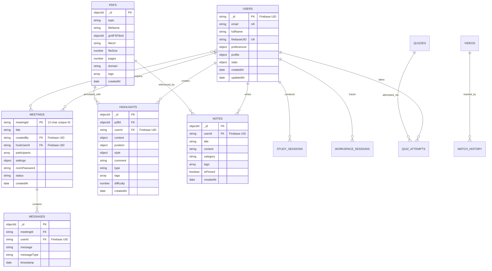

# 📊 Axiona Study Platform - Complete Database ERD & Schema Documentation

**Last Updated**: December 2024  
**Database**: MongoDB Atlas (NoSQL Document Store)  
**ODM**: Mongoose  
**Authentication**: Firebase UID as primary key for users

---

## 🎯 **Database Overview**

### **Core Statistics**
- **Database Type**: MongoDB Atlas (NoSQL Document Store)
- **ODM**: Mongoose
- **Authentication**: Firebase UID as primary key for users
- **File Storage**: GridFS (MongoDB) for PDFs
- **Total Collections**: 24 active collections
- **Primary Features**: Video conferencing, PDF annotations, note-taking, quiz system, user analytics

### **Key Design Principles**
1. **Firebase Integration**: Uses Firebase UID as primary user identifier
2. **Performance Optimized**: Compound indexes for frequent query patterns
3. **Scalable Architecture**: Document-based design for flexible data structures
4. **Real-time Support**: Optimized for Socket.IO and live collaboration
5. **Security**: User-scoped data with proper access controls

---

## 📋 **Entity Relationship Diagram**



---

## 🗃️ **Complete Database Schema**

### **1. 👥 USERS Collection**

**Purpose**: Core user management with Firebase authentication integration

```javascript
{
  _id: String, // Firebase UID (Primary Key)
  fullName: {
    type: String,
    required: true,
    trim: true,
    maxlength: 100
  },
  email: {
    type: String,
    required: true,
    unique: true,
    lowercase: true,
    trim: true,
    match: [/^\w+([.-]?\w+)*@\w+([.-]?\w+)*(\.\w{2,3})+$/, 'Please provide a valid email']
  },
  firebaseUID: {
    type: String,
    required: true,
    unique: true
  },
  passwordHash: {
    type: String,
    required: false, // Firebase handles authentication
    minlength: 6
  },
  avatarUrl: {
    type: String,
    default: null
  },
  preferences: {
    theme: {
      type: String,
      enum: ['light', 'dark'],
      default: 'light'
    },
    language: {
      type: String,
      default: 'en'
    },
    emailNotif: {
      type: Boolean,
      default: true
    },
    pushNotif: {
      type: Boolean,
      default: true
    }
  },
  profile: {
    bio: {
      type: String,
      maxlength: 500
    },
    institution: String,
    academicYear: String,
    subjects: [String],
    goals: [String],
    socialLinks: {
      linkedin: String,
      github: String,
      twitter: String
    }
  },
  stats: {
    totalStudyHours: {
      type: Number,
      default: 0
    },
    completedSessions: {
      type: Number,
      default: 0
    },
    streakDays: {
      type: Number,
      default: 0
    },
    totalNotes: {
      type: Number,
      default: 0
    },
    videosWatched: {
      type: Number,
      default: 0
    },
    pdfsViewed: {
      type: Number,
      default: 0
    }
  },
  settings: {
    isPrivate: {
      type: Boolean,
      default: false
    },
    allowMessages: {
      type: Boolean,
      default: true
    },
    showOnlineStatus: {
      type: Boolean,
      default: true
    }
  },
  subscription: {
    plan: {
      type: String,
      enum: ['free', 'premium'],
      default: 'free'
    },
    startDate: Date,
    endDate: Date,
    features: [String]
  },
  createdAt: {
    type: Date,
    default: Date.now
  },
  updatedAt: {
    type: Date,
    default: Date.now
  },
  lastActiveAt: {
    type: Date,
    default: Date.now
  }
}
```

**Indexes:**
```javascript
// Unique indexes
{ email: 1 } // unique
{ firebaseUID: 1 } // unique

// Search indexes
{ fullName: "text", email: "text" }

// Query optimization
{ createdAt: -1 }
{ lastActiveAt: -1 }
```

---

### **2. 🎥 MEETINGS Collection (Video Conference)**

**Purpose**: Video conference management with real-time collaboration

```javascript
{
  meetingId: {
    type: String,
    required: true,
    unique: true,
    trim: true // 12-character unique identifier
  },
  title: {
    type: String,
    required: true,
    trim: true,
    maxlength: 200
  },
  description: {
    type: String,
    maxlength: 1000,
    trim: true
  },
  createdBy: {
    type: String, // Firebase UID
    ref: 'User',
    required: true
  },
  hostUserId: {
    type: String, // Firebase UID - current host (can change)
    ref: 'User',
    required: true
  },
  participants: [{
    userId: {
      type: String, // Firebase UID
      ref: 'User',
      required: true
    },
    userName: {
      type: String,
      required: true
    },
    userEmail: String,
    joinedAt: {
      type: Date,
      default: Date.now
    },
    leftAt: Date,
    role: {
      type: String,
      enum: ['host', 'moderator', 'participant'],
      default: 'participant'
    },
    isActive: {
      type: Boolean,
      default: true
    }
  }],
  settings: {
    maxParticipants: {
      type: Number,
      default: 6,
      max: 6
    },
    allowChat: {
      type: Boolean,
      default: true
    },
    allowScreenShare: {
      type: Boolean,
      default: true
    },
    allowRecording: {
      type: Boolean,
      default: false
    },
    requirePassword: {
      type: Boolean,
      default: false
    },
    waitingRoom: {
      type: Boolean,
      default: false
    }
  },
  roomPassword: {
    type: String,
    minlength: 4,
    maxlength: 20,
    trim: true
  },
  status: {
    type: String,
    enum: ['scheduled', 'active', 'ended', 'cancelled'],
    default: 'scheduled'
  },
  roomId: {
    type: String,
    required: true,
    trim: true // Socket.IO room identifier
  },
  scheduledStartTime: Date,
  actualStartTime: Date,
  endTime: Date,
  duration: Number, // Total duration in seconds
  maxConcurrentParticipants: {
    type: Number,
    default: 0
  },
  recordingUrl: String,
  createdAt: {
    type: Date,
    default: Date.now
  },
  updatedAt: {
    type: Date,
    default: Date.now
  }
}
```

**Indexes:**
```javascript
{ meetingId: 1 } // unique
{ createdBy: 1, createdAt: -1 }
{ status: 1 }
{ roomId: 1 }
{ 'participants.userId': 1 }
```

---

### **3. 💬 MESSAGES Collection (Chat System)**

**Purpose**: Real-time chat messages for video conferences

```javascript
{
  meetingId: {
    type: String,
    required: true,
    ref: 'Meeting'
  },
  userId: {
    type: String, // Firebase UID
    required: true,
    ref: 'User'
  },
  userName: {
    type: String,
    required: true
  },
  userEmail: String,
  message: {
    type: String,
    required: true,
    maxlength: 1000,
    trim: true
  },
  messageType: {
    type: String,
    enum: ['text', 'system', 'emoji', 'file'],
    default: 'text'
  },
  timestamp: {
    type: Date,
    default: Date.now
  },
  reactions: [{
    userId: String,
    emoji: String,
    timestamp: {
      type: Date,
      default: Date.now
    }
  }],
  editedAt: Date,
  deletedAt: Date,
  isSystem: {
    type: Boolean,
    default: false
  },
  metadata: {
    fileUrl: String,
    fileName: String,
    fileSize: Number
  }
}
```

**Indexes:**
```javascript
{ meetingId: 1, timestamp: -1 }
{ userId: 1, timestamp: -1 }
{ timestamp: 1 } // TTL index for automatic cleanup
```

---

### **4. 📄 PDFS Collection (Study Materials)**

**Purpose**: PDF document management with GridFS storage

```javascript
{
  topic: {
    type: String,
    required: true,
    trim: true,
    maxlength: 200
  },
  fileName: {
    type: String,
    required: true,
    trim: true
  },
  gridFSFileId: {
    type: mongoose.Schema.Types.ObjectId,
    required: true,
    ref: 'fs.files' // GridFS files collection
  },
  fileUrl: {
    type: String,
    required: true,
    validate: {
      validator: function(v) {
        return /^(https?:\/\/.+\.pdf$|\/docs\/.+\.pdf$|\/api\/pdfs\/file\/.+)$/i.test(v);
      },
      message: 'Invalid PDF URL format'
    }
  },
  fileSize: {
    type: Number,
    required: true,
    min: 0
  },
  pages: {
    type: Number,
    required: true,
    min: 1
  },
  author: {
    type: String,
    trim: true,
    maxlength: 100
  },
  domain: {
    type: String,
    trim: true,
    maxlength: 100
  },
  description: {
    type: String,
    maxlength: 1000,
    trim: true
  },
  uploadedBy: {
    type: String, // Firebase UID
    ref: 'User'
  },
  uploadDate: {
    type: Date,
    default: Date.now
  },
  downloadCount: {
    type: Number,
    default: 0
  },
  isPublic: {
    type: Boolean,
    default: true
  },
  tags: [String],
  metadata: {
    subject: String,
    class: String,
    year: String,
    institution: String,
    language: {
      type: String,
      default: 'en'
    }
  },
  thumbnail: String, // URL to thumbnail image
  extractedText: String, // For search functionality
  createdAt: {
    type: Date,
    default: Date.now
  },
  updatedAt: {
    type: Date,
    default: Date.now
  }
}
```

**Indexes:**
```javascript
{ topic: "text", author: "text", description: "text" }
{ domain: 1, uploadDate: -1 }
{ uploadedBy: 1 }
{ tags: 1 }
{ gridFSFileId: 1 } // unique
```

---

### **5. 🖍️ HIGHLIGHTS Collection (PDF Annotations)**

**Purpose**: PDF highlighting and annotation system with spaced repetition

```javascript
{
  pdfId: {
    type: Schema.Types.ObjectId,
    ref: 'PDF',
    required: true,
    index: true
  },
  userId: {
    type: String, // Firebase UID
    ref: 'User',
    required: true,
    index: true
  },
  content: {
    text: {
      type: String,
      required: true,
      maxlength: 5000
    },
    image: String // Optional screenshot of highlighted area
  },
  position: {
    pageNumber: {
      type: Number,
      required: true,
      min: 1
    },
    boundingRect: {
      x1: { type: Number, required: true },
      y1: { type: Number, required: true },
      x2: { type: Number, required: true },
      y2: { type: Number, required: true },
      width: { type: Number, required: true },
      height: { type: Number, required: true }
    },
    rects: [{ // Multiple rects for text spanning multiple lines
      x1: Number,
      y1: Number,
      x2: Number,
      y2: Number,
      width: Number,
      height: Number
    }],
    viewportDimensions: {
      width: Number,
      height: Number
    }
  },
  style: {
    color: {
      type: String,
      default: '#ffeb3b', // Yellow highlight
      validate: {
        validator: function(v) {
          return /^#[0-9A-F]{6}$/i.test(v);
        },
        message: 'Invalid color format. Use hex format like #ffeb3b'
      }
    },
    opacity: {
      type: Number,
      default: 0.3,
      min: 0.1,
      max: 1
    }
  },
  comment: {
    type: String,
    maxlength: 2000,
    trim: true
  },
  type: {
    type: String,
    enum: ['highlight', 'underline', 'strikethrough', 'note'],
    default: 'highlight'
  },
  tags: [{
    type: String,
    trim: true,
    maxlength: 50
  }],
  reviewCount: {
    type: Number,
    default: 0
  },
  lastReviewed: Date,
  difficulty: {
    type: Number,
    min: 1,
    max: 5,
    default: 3
  },
  createdAt: {
    type: Date,
    default: Date.now
  },
  updatedAt: {
    type: Date,
    default: Date.now
  }
}
```

**Compound Indexes (Performance Optimized):**
```javascript
// Primary query pattern: get highlights for specific PDF and user, sorted by page
{ pdfId: 1, userId: 1, 'position.pageNumber': 1 }

// User-centric queries: timeline and recent activity
{ userId: 1, createdAt: -1 }
{ userId: 1, updatedAt: -1 }

// User's highlights in specific PDF, chronologically sorted
{ userId: 1, pdfId: 1, createdAt: -1 }

// Tag-based filtering for user
{ userId: 1, tags: 1 }

// Spaced repetition and study session queries
{ userId: 1, lastReviewed: 1 }
{ userId: 1, difficulty: 1, lastReviewed: 1 }
{ userId: 1, reviewCount: 1 }

// Search optimization for text content
{ userId: 1, 'content.text': 'text' }

// Type-specific queries
{ userId: 1, type: 1, createdAt: -1 }
```

---

### **6. 📝 NOTES Collection (User Notes)**

**Purpose**: Personal and collaborative note-taking system

```javascript
{
  userId: {
    type: String, // Firebase UID
    required: true,
    ref: 'User'
  },
  title: {
    type: String,
    required: true,
    trim: true,
    maxlength: 200
  },
  content: {
    type: String,
    required: true // Supports markdown
  },
  category: {
    type: String,
    enum: ['personal', 'study', 'meeting', 'idea', 'project'],
    default: 'personal'
  },
  tags: [String],
  subject: String,
  linkedDocuments: [{
    type: Schema.Types.ObjectId,
    ref: 'PDF'
  }],
  linkedMeetings: [String], // Meeting IDs
  isPinned: {
    type: Boolean,
    default: false
  },
  isArchived: {
    type: Boolean,
    default: false
  },
  color: {
    type: String,
    default: '#ffffff'
  },
  reminder: {
    datetime: Date,
    message: String,
    isActive: {
      type: Boolean,
      default: false
    }
  },
  collaborators: [String], // Firebase UIDs
  sharedWith: [String], // Firebase UIDs
  isPublic: {
    type: Boolean,
    default: false
  },
  metadata: {
    wordCount: Number,
    readingTime: Number, // Estimated reading time in minutes
    lastEditedBy: String // Firebase UID
  },
  createdAt: {
    type: Date,
    default: Date.now
  },
  updatedAt: {
    type: Date,
    default: Date.now
  }
}
```

**Indexes:**
```javascript
{ userId: 1, createdAt: -1 }
{ userId: 1, category: 1 }
{ userId: 1, tags: 1 }
{ userId: 1, isPinned: -1, createdAt: -1 }
{ title: "text", content: "text", tags: "text" }
```

---

### **7. 📊 QUIZZES Collection**

**Purpose**: Interactive quiz system with multiple question types

```javascript
{
  title: {
    type: String,
    required: true,
    trim: true,
    maxlength: 200
  },
  description: String,
  subject: String,
  category: String,
  difficulty: {
    type: String,
    enum: ['Beginner', 'Intermediate', 'Advanced'],
    default: 'Beginner'
  },
  totalQuestions: {
    type: Number,
    required: true,
    min: 1
  },
  maxMarks: {
    type: Number,
    required: true,
    min: 1
  },
  duration: {
    type: Number, // Minutes
    required: true,
    min: 1
  },
  passingMarks: {
    type: Number,
    required: true,
    min: 0
  },
  instructions: [String],
  questions: [{
    id: {
      type: String,
      required: true
    },
    question: {
      type: String,
      required: true
    },
    type: {
      type: String,
      enum: ['multiple-choice', 'true-false', 'fill-blank', 'essay'],
      default: 'multiple-choice'
    },
    options: [String],
    correctAnswer: String,
    explanation: String,
    marks: {
      type: Number,
      default: 1
    },
    timeLimit: Number, // Seconds
    difficulty: String,
    topics: [String],
    image: String,
    diagram: String
  }],
  settings: {
    isTimeLimited: {
      type: Boolean,
      default: true
    },
    allowReview: {
      type: Boolean,
      default: true
    },
    shuffleQuestions: {
      type: Boolean,
      default: false
    },
    shuffleOptions: {
      type: Boolean,
      default: false
    },
    showResults: {
      type: Boolean,
      default: true
    },
    retakeAllowed: {
      type: Boolean,
      default: true
    },
    maxAttempts: {
      type: Number,
      default: 3
    }
  },
  createdBy: {
    type: String, // Firebase UID
    required: true,
    ref: 'User'
  },
  sourceDocumentIds: [{
    type: Schema.Types.ObjectId,
    ref: 'PDF'
  }],
  tags: [String],
  prerequisites: [String],
  isPublic: {
    type: Boolean,
    default: false
  },
  publishedAt: Date,
  createdAt: {
    type: Date,
    default: Date.now
  },
  updatedAt: {
    type: Date,
    default: Date.now
  }
}
```

**Indexes:**
```javascript
{ subject: 1, category: 1, difficulty: 1 }
{ title: "text", description: "text", tags: "text" }
{ createdBy: 1, createdAt: -1 }
{ isPublic: 1, publishedAt: -1 }
```

---

### **8. 🎬 VIDEOS Collection (Tutorial Hub)**

**Purpose**: YouTube video management and tracking

```javascript
{
  title: {
    type: String,
    required: true,
    trim: true
  },
  description: String,
  youtubeId: {
    type: String,
    required: true,
    unique: true
  },
  url: {
    type: String,
    required: true
  },
  thumbnail: String,
  duration: Number, // Seconds
  category: String,
  subject: String,
  difficulty: {
    type: String,
    enum: ['Beginner', 'Intermediate', 'Advanced']
  },
  tags: [String],
  instructor: String,
  publishedDate: Date,
  viewCount: {
    type: Number,
    default: 0
  },
  rating: {
    type: Number,
    min: 1,
    max: 5
  },
  ratingCount: {
    type: Number,
    default: 0
  },
  transcript: String, // Auto-generated or manual
  chapters: [{
    title: String,
    startTime: Number, // Seconds
    endTime: Number
  }],
  relatedVideos: [{
    type: Schema.Types.ObjectId,
    ref: 'Video'
  }],
  isActive: {
    type: Boolean,
    default: true
  },
  createdAt: {
    type: Date,
    default: Date.now
  },
  updatedAt: {
    type: Date,
    default: Date.now
  }
}
```

**Indexes:**
```javascript
{ subject: 1, category: 1 }
{ youtubeId: 1 } // unique
{ tags: 1 }
{ title: "text", description: "text", instructor: "text" }
{ isActive: 1, viewCount: -1 }
```

---

### **9. 📈 STUDY_SESSIONS Collection**

**Purpose**: Study session tracking and analytics

```javascript
{
  userId: {
    type: String, // Firebase UID
    required: true,
    ref: 'User'
  },
  sessionType: {
    type: String,
    enum: ['solo', 'group', 'meeting'],
    default: 'solo'
  },
  title: String,
  subject: String,
  startTime: {
    type: Date,
    required: true
  },
  endTime: Date,
  duration: Number, // Seconds
  status: {
    type: String,
    enum: ['planned', 'active', 'completed', 'cancelled'],
    default: 'planned'
  },
  goals: [String],
  completedGoals: [String],
  resources: [{
    type: {
      type: String,
      enum: ['pdf', 'video', 'note', 'quiz']
    },
    resourceId: String,
    timeSpent: Number // Seconds
  }],
  participants: [String], // Firebase UIDs for group sessions
  meetingId: String, // If linked to video conference
  notes: String,
  mood: {
    type: String,
    enum: ['excellent', 'good', 'okay', 'poor']
  },
  productivity: {
    type: Number,
    min: 1,
    max: 10
  },
  distractions: [String],
  achievements: [String],
  createdAt: {
    type: Date,
    default: Date.now
  },
  updatedAt: {
    type: Date,
    default: Date.now
  }
}
```

**Indexes:**
```javascript
{ userId: 1, startTime: -1 }
{ userId: 1, status: 1 }
{ subject: 1, startTime: -1 }
{ sessionType: 1, startTime: -1 }
```

---

### **10. 💻 WORKSPACE_SESSIONS Collection**

**Purpose**: Detailed workspace usage analytics

```javascript
{
  userId: {
    type: String, // Firebase UID
    required: true,
    ref: 'User'
  },
  sessionId: {
    type: String,
    required: true,
    unique: true
  },
  startTime: {
    type: Date,
    required: true
  },
  endTime: Date,
  duration: Number, // Seconds
  activeTabs: [{
    type: {
      type: String,
      enum: ['pdf', 'video', 'note', 'quiz', 'meeting']
    },
    resourceId: String,
    title: String,
    timeSpent: Number,
    interactions: Number
  }],
  totalInteractions: {
    type: Number,
    default: 0
  },
  screenshotsTaken: {
    type: Number,
    default: 0
  },
  notesCreated: {
    type: Number,
    default: 0
  },
  highlightsAdded: {
    type: Number,
    default: 0
  },
  quizzesCompleted: {
    type: Number,
    default: 0
  },
  videosWatched: {
    type: Number,
    default: 0
  },
  meetingsJoined: {
    type: Number,
    default: 0
  },
  focusScore: Number, // Calculated productivity score (0-100)
  isCompleted: {
    type: Boolean,
    default: false
  },
  metadata: {
    device: String,
    browser: String,
    screenResolution: String,
    userAgent: String
  },
  createdAt: {
    type: Date,
    default: Date.now
  },
  updatedAt: {
    type: Date,
    default: Date.now
  }
}
```

**Indexes:**
```javascript
{ userId: 1, startTime: -1 }
{ sessionId: 1 } // unique
{ userId: 1, isCompleted: 1 }
{ startTime: 1 } // For analytics queries
```

---

## 🔗 **Database Relationships & Foreign Keys**

### **Primary Relationships:**

1. **Users → Everything**: 
   - Firebase UID as foreign key in all user-related collections
   - One-to-many relationships with notes, highlights, sessions

2. **PDFs → Highlights**: 
   - One PDF can have many highlights
   - `pdfId` (ObjectId) references PDFs collection

3. **Meetings → Messages**: 
   - One meeting can have many chat messages
   - `meetingId` (String) references Meetings collection

4. **Users → Study Sessions**: 
   - One user can have many study sessions
   - `userId` (Firebase UID) references Users collection

5. **PDFs → Notes**: 
   - Many-to-many relationship via `linkedDocuments` array

### **Key Foreign Keys:**

| Field | Type | References | Description |
|-------|------|------------|-------------|
| `userId` | String | Users._id | Firebase UID in all user-related collections |
| `pdfId` | ObjectId | PDFs._id | References PDFs collection in highlights |
| `meetingId` | String | Meetings.meetingId | References meetings for messages |
| `gridFSFileId` | ObjectId | fs.files._id | GridFS file storage reference |
| `createdBy` | String | Users._id | Firebase UID for content creators |
| `hostUserId` | String | Users._id | Firebase UID for meeting hosts |

---

## ⚡ **Performance Optimization Strategy**

### **Indexing Strategy:**

1. **Compound Indexes**: 
   - User-scoped queries: `{ userId: 1, createdAt: -1 }`
   - Meeting operations: `{ meetingId: 1, timestamp: -1 }`
   - PDF annotations: `{ pdfId: 1, userId: 1, pageNumber: 1 }`

2. **Text Search Indexes**: 
   - Content search across titles, descriptions, and tags
   - Full-text search capabilities for notes and documents

3. **Sparse Indexes**: 
   - Optional fields like `roomPassword`, `reminder.datetime`
   - Improves query performance for filtered searches

4. **TTL Indexes**: 
   - Automatic cleanup of temporary data (messages, sessions)
   - Configurable expiration times

### **Query Optimization Patterns:**

```javascript
// User dashboard data (most common)
{ userId: 1, createdAt: -1 }

// Real-time meeting operations
{ meetingId: 1 }, { status: 1 }

// PDF annotation retrieval
{ pdfId: 1, userId: 1, 'position.pageNumber': 1 }

// Content search
{ $text: { $search: "query terms" } }

// Analytics queries
{ userId: 1, startTime: { $gte: startDate, $lt: endDate } }
```

---

## 💾 **Storage Architecture**

### **File Storage Strategy:**

1. **GridFS (MongoDB)**:
   - **PDFs**: Complete document storage with metadata
   - **Images**: Screenshots, thumbnails, diagrams
   - **Recordings**: Meeting recordings (optional)
   - **Advantages**: Integrated with MongoDB, automatic chunking, metadata support

2. **External Storage**:
   - **Firebase Storage**: User profile images, avatars
   - **CDN**: Static assets, thumbnails for fast loading
   - **YouTube**: Video content (embedded, not stored)

### **Data Retention Policies:**

1. **Active Data**: Indefinite retention for user content
2. **Session Data**: 90-day retention for workspace sessions
3. **Chat Messages**: 30-day retention for meeting chat
4. **Analytics Data**: 1-year retention for usage statistics
5. **Temporary Files**: Auto-cleanup via TTL indexes

---

## 🔒 **Security & Access Control**

### **Data Access Patterns:**

1. **User-Scoped Data**: All personal data filtered by Firebase UID
2. **Meeting Access**: Participant validation for meeting data
3. **Public Content**: PDFs and videos with public flag
4. **Admin Access**: Special permissions for user management

### **Security Measures:**

1. **Authentication**: Firebase JWT token validation
2. **Authorization**: Role-based access control (RBAC)
3. **Data Validation**: Mongoose schema validation
4. **Input Sanitization**: XSS and injection prevention
5. **Rate Limiting**: API endpoint protection

---

## 📊 **Analytics & Monitoring**

### **Key Metrics Tracked:**

1. **User Engagement**:
   - Study session duration and frequency
   - Note creation and highlight activity
   - Video watch time and completion rates

2. **System Performance**:
   - Database query performance
   - Meeting connection quality
   - File upload/download speeds

3. **Content Usage**:
   - Most accessed PDFs and videos
   - Popular quiz topics
   - Meeting participation rates

### **Monitoring Setup:**

1. **Database Monitoring**: MongoDB Atlas monitoring
2. **Performance Metrics**: Query execution time tracking
3. **User Analytics**: Session tracking and behavior analysis
4. **Error Tracking**: Application error monitoring

---

## 🚀 **Scalability Considerations**

### **Horizontal Scaling:**

1. **Sharding Strategy**: User-based sharding on Firebase UID
2. **Read Replicas**: Read-heavy operations distributed
3. **Caching Layer**: Redis for frequently accessed data
4. **CDN Integration**: Global content delivery

### **Performance Optimizations:**

1. **Aggregation Pipelines**: Complex analytics queries
2. **Bulk Operations**: Batch inserts and updates
3. **Connection Pooling**: Optimized database connections
4. **Lazy Loading**: On-demand data retrieval

---

This comprehensive database schema supports the complete Axiona study platform with real-time video conferencing, advanced PDF annotation system, collaborative note-taking, interactive quizzes, and detailed user analytics. The design is optimized for performance, scalability, and maintainability while ensuring data security and user privacy.
